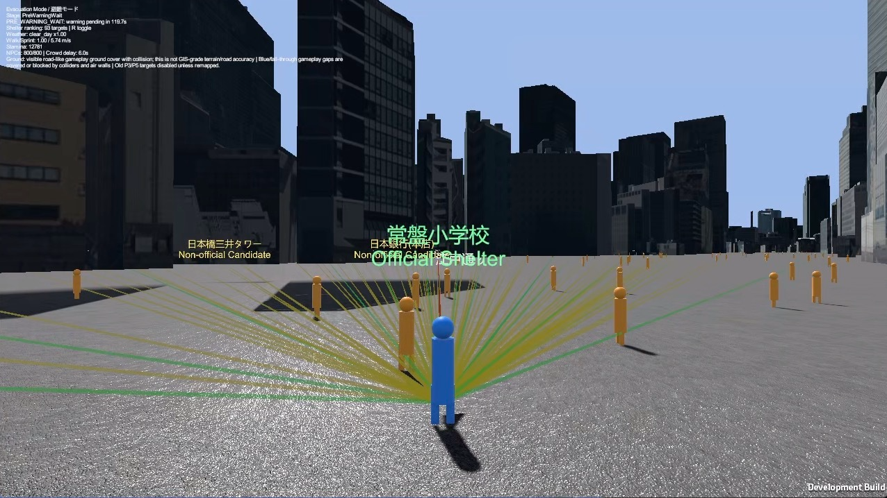
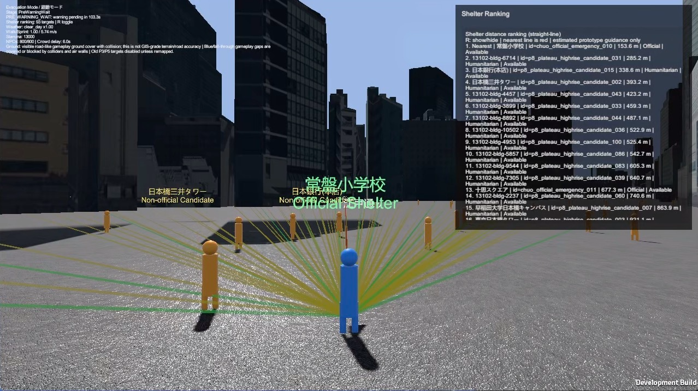

# Chuo Tsunami Evacuation

**A tsunami evacuation mini-game prepared for the Chuo University 2026 Open Campus laboratory visit.**

Explore Tokyo's Chuo City in a Unity-based 3D environment, compare shelter choices, and try an evacuation under time pressure. This research and educational demo gives laboratory visitors a hands-on introduction to evacuation decisions, urban risk visualization, and the effect of congestion on reaching shelter.

[Download Windows v1.0](https://github.com/LN6666/ChuoTsunamiEvacuation/releases/tag/p11-final-v1.0) · [How to play](#game-rules) · [Controls](#controls) · [English rules](docs/GAME_RULES_EN.md) · [日本語ルール](docs/GAME_RULES_JA.md)



*Development-build gameplay supplied by the project owner. Official shelter references and non-official candidates have separate labels. The colored lines are prototype guidance.*

> **For education and demonstration only.** This game must not be used for real evacuation decisions. It does not replace official hazard maps, municipal guidance, or instructions from emergency services.

## Project Purpose

The project supports laboratory demonstrations and public communication of urban disaster evacuation research at Chuo University Open Campus 2026. Visitors can explore the city, make a shelter choice, and discuss how timing, access, and crowd delays influence the outcome of a simplified scenario.

Real disaster dynamics are deliberately simplified to make a short, interactive demonstration possible. A successful game run does not establish that a building or route would be safe in a real emergency.

## Gameplay Concept

| Mode | Experience |
|---|---|
| **Tourism Mode** | Explore the map and inspect building targets. Stamina drain and evacuation hazard failures are disabled. |
| **Evacuation Mode** | Respond to a warning, choose a usable shelter, and complete the safe-floor sequence before the active risk front causes failure. Sprinting uses stamina, and congestion can add delay. |

Evacuation Mode has two stages: an initial warning period, followed by an approaching risk front. The light curtain and hazard contact checks become active in the second stage. Shelter availability, entrance conditions, and the time needed to reach the safe-floor proxy affect the result.

Rain and night settings can reduce movement speed, and night mode darkens the scene. The release-specific rules are available in [English](docs/GAME_RULES_EN.md) and [Japanese](docs/GAME_RULES_JA.md); the overview below explains the main concepts for first-time visitors.



*Press **R** to show or hide the shelter ranking. Its distances are straight-line estimates, not verified walking routes or travel times. This is another gameplay view, not a result screen.*

## Game Rules

### Basic Goal

Reach a usable shelter and finish its safe-floor sequence before the scenario's failure conditions are triggered. Getting close to a building or seeing a green frame is not enough to complete evacuation. The outcome depends on shelter access, timing, congestion, and the active scenario conditions.

### Starting Point

Each run starts at a configured spawn point in the urban map, representing a pedestrian in Chuo City. Scenario configurations can use different starting locations; these are game starting positions rather than recommended real-world evacuation origins.

### Shelter Selection

Targets distinguish source-backed official shelter references from non-official high-rise or humanitarian candidates and other training targets. Check the label and availability before approaching a target.

Non-official candidates remain explicitly non-official. Their inclusion does not establish public access, structural suitability, or safety approval. Green frames are gameplay guidance markers and do not certify a shelter. Targets unavailable in the active map are disabled.

### Navigation

Use the map's direction lines, guidance markers, and shelter ranking to compare destinations while observing the environment and risk front. Guidance is estimated for the prototype; a direct line can cross buildings or other obstacles and is not a traversable route. Neither the nearest target nor the shortest displayed distance is an official evacuation recommendation.

### Tsunami Risk Visualization

The tsunami light curtain is a simplified, partly cinematic risk front used to communicate time pressure and shrinking safe space. It does not reproduce physical wave height, flow velocity, water depth, or an official inundation model. During the initial warning stage the curtain is hidden and risk contact is ignored; the approaching-front stage activates the curtain and hazard checks.

### Hazard Areas

Scenario settings can mark places or targets as hazardous, blocked, or unavailable. Waterfront, road, bridge, and underground risk are demonstration topics; the active configuration determines which checks apply. These representations must not be read as a surveyed hazard map, a prediction of road closure, or proof that every such feature has a separate playable scenario.

### NPCs and Congestion

NPCs populate the city, and local crowd conditions can add an entrance delay to the safe-floor sequence. A delay can make an otherwise reachable target too slow. Crowd behavior is a gameplay proxy, not a forecast of real pedestrian flows; distant NPCs may use simplified static behavior for performance.

### Indoor and Vertical Evacuation

Approach a valid building's entrance interaction area and press **E**. Where entry is available, the game runs an abstracted safe-floor sequence with a configured climb time and any crowd delay.

**The current release has no explorable, verified building interiors.** Stairs, corridors, and upper-floor movement are represented through a proxy flow rather than real indoor navigation or reconstructed floor plans. See the [indoor-scene decision](docs/P9_NO_INDOOR_SCENE_DECISION.md).

### Success Conditions

A run succeeds when the selected target is usable and the required safe-floor sequence finishes before an active failure condition occurs. Availability of the entrance and safe-floor proxy matters, as does the time remaining after any congestion delay.

### Failure Conditions

Depending on the scenario, a run can fail when the active risk front reaches the player or shelter, an entrance is blocked, a safe-floor proxy is unavailable, or a configured hazard condition is triggered. Delay may leave insufficient time to finish evacuation. Failure messages explain the condition encountered; they are game feedback rather than a real-world risk assessment.

### Result Panel

Outcome feedback identifies success or failure and explains the shelter choice, warnings, and relevant failure reason. Depending on the scenario and evaluation flow, the result panel or local run records may also include shelter-entry and climb timing, estimated route timing, risk arrival, and crowd information. Not every field appears in every run.

## Controls

| Action | Control |
|---|---|
| Move | **W / A / S / D** or **arrow keys** |
| Sprint | **Left or right Shift** |
| Rotate the camera | Hold the **left or right mouse button** and drag |
| Interact with a nearby building / begin shelter entry | **E** in the entrance interaction area |
| Show or hide shelter ranking | **R** |
| Pause or resume an active mode | **Esc** |
| Choose a mode, change language, or open rules | Click the on-screen buttons |
| Toggle borderless fullscreen / windowed mode | **F11** or **Alt + Enter** |

Tourism Mode has no stamina restriction. Evacuation Mode uses stamina. See the [controls reference](docs/CONTROLS.md) for display-mode notes.

## Demo Scenarios

The project includes scenario checks and prototype conditions for comparing:

- Reaching an available official shelter reference in time.
- Warning-stage behavior and pressure from the approaching light curtain.
- Route and hazard constraints, including road, bridge, underground, and waterfront discussion topics where configured.
- Entrance congestion and its effect on evacuation time.
- Shelter entry and the abstracted safe-floor sequence.
- A non-official high-rise “life-first candidate,” retaining its candidate warnings.

These are demonstration and comparison cases, not official disaster-planning scenarios or a promise of six separate menu entries. The [scenario status](docs/NEWMAP_SCENARIO_FINAL_STATUS.md) and [candidate rules](docs/P9C_LIFE_FIRST_VERTICAL_TARGET_RULES.md) document the implemented proxy boundaries.

## Windows Release

**[P11 Final v1.0 — Windows x64](https://github.com/LN6666/ChuoTsunamiEvacuation/releases/tag/p11-final-v1.0)** is available as a portable ZIP (approximately **2.05 GB** compressed).

1. Download `ChuoTsunamiEvacuation_v1.0.zip` from the release page.
2. Extract the entire archive to a local folder.
3. Keep the executable, `ChuoTsunamiEvacuation_Data/`, and bundled runtime files together.
4. Run `ChuoTsunamiEvacuation.exe`. Start with Tourism Mode to check the map and controls, then try Evacuation Mode.

The documented package layout includes:

```text
ChuoTsunamiEvacuation_v1.0/
├── ChuoTsunamiEvacuation.exe
├── ChuoTsunamiEvacuation_Data/
├── UnityPlayer.dll
├── README_RUN.md
├── INSTALL_AND_RUN.md
├── CONTROLS.md
├── GAME_RULES_EN.md
├── GAME_RULES_JA.md
├── DATA_SOURCES.md
├── ATTRIBUTION.md
├── KNOWN_LIMITATIONS.md
├── RELEASE_NOTES.md
├── SECOND_PC_INSTALL_TEST_GUIDE.md
├── SECOND_PC_TEST_REPORT_TEMPLATE.md
├── PLAYER_LOG_LOCATION.md
├── VERSION.txt
└── PACKAGE_MANIFEST.json
```

See [run instructions](docs/README_RUN.md), [package structure](docs/P11_RELEASE_PACKAGE_STRUCTURE.md), and the [second-PC test guide](docs/SECOND_PC_INSTALL_TEST_GUIDE.md). Initial loading can stutter, and the city scene may need a capable Windows PC; no universal hardware or frame-rate guarantee is claimed. The published executable has not been rebuilt for this README update.

## Important Disclaimer

This is a research-oriented educational prototype, **not an official disaster prevention product or an operational evacuation navigation system**.

- Do not use game outcomes to make real evacuation decisions. Follow current local-authority and emergency-service instructions.
- Tsunami visualization and hazard behavior are simplified proxies rather than physical disaster predictions.
- Shelter entry, safe-floor timing, routes, ground surfaces, and NPC behavior are prototype representations. Candidate buildings are not official shelters.
- Detailed 3D exteriors do not establish GIS-grade road, terrain, entrance, or indoor accuracy. Labels and visual alignment may be incomplete.

Read the [known limitations](docs/KNOWN_LIMITATIONS.md) before using the build for a presentation or evaluation.

## Data Sources and Attribution

The city environment is prepared from **Project PLATEAU** 3D city models, provided by Japan's Ministry of Land, Infrastructure, Transport and Tourism. The pipeline also references official Chuo/Tokyo shelter and qualification materials, OpenStreetMap-derived route or name data, and GSI or other Japanese open-data references where recorded in its outputs.

OpenStreetMap-derived content is attributed to **OpenStreetMap contributors** and is subject to the **Open Database License (ODbL)**. Custom gameplay data supplies the proxy hazards, crowd delays, safe-floor behavior, and tuning. Unity and package dependencies are listed in [Packages/manifest.json](Packages/manifest.json); their respective terms apply. No blanket license for third-party content is implied.

See [Data Sources](docs/DATA_SOURCES.md), [Attribution](docs/ATTRIBUTION.md), and [building-name attribution](docs/NEWMAP_NAME_LABEL_ATTRIBUTION.md). Runtime gameplay uses prepared local data and does not query online map or name services.

## Repository Structure

| Directory | Contents |
|---|---|
| `Assets/` | Unity scripts, configuration, assets, and tests |
| `Packages/` | Unity package configuration |
| `ProjectSettings/` | Unity editor and project settings |
| `data_pipeline/` | Geospatial and shelter-data preparation materials |
| `docs/` | Gameplay rules, release instructions, QA records, and project decisions |
| `tools/` | Validation, map preparation, build, and release utilities |

The source project records **Unity 6000.4.6f1**. A fresh clone is not a self-contained playable Unity project: the generated `Chuo_BaseMap.unity` scene and raw PLATEAU data are intentionally kept outside Git, and the PLATEAU SDK dependency currently points to a local Windows package. Use the portable release to try the game; rebuilding requires restoring the local map assets and package setup.

## Project Status

**The project is complete and closed out, with the PBL11 v1.0 Windows release available for demonstration.** Final integration, QA, and packaging followed the PBL10 development stage. Release notes, build records, and handoff material are retained for reference. This repository presents the completed educational prototype; no new major gameplay development is planned as part of this project.

[Release notes](docs/RELEASE_NOTES.md) · [Gameplay specification](docs/GAMEPLAY_SPEC.md) · [Known limitations](docs/KNOWN_LIMITATIONS.md) · [Report an issue](https://github.com/LN6666/ChuoTsunamiEvacuation/issues)
